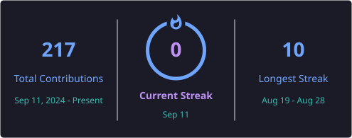

<h1 align="center">👋 Hi, I'm Yash Agarwal</h1>

<h3 align="center">
B.Tech CSE (AI) @ Bennett University
</h3>

<p align="center">
  
</p>

<p align="center">
  
</p>

---

# 👨‍💻 About Me

I'm a **Computer Science student specializing in Artificial Intelligence** at Bennett University.

I enjoy building practical applications using **Machine Learning, Deep Learning, Computer Vision, NLP, Generative AI, Agentic AI and Full-Stack Development**.

### 🚀 Currently Focused On

- 🤖 Artificial Intelligence & Machine Learning
- 👁️ Computer Vision
- 🧠 Deep Learning
- ✨ Generative AI
- 🤖 Agentic AI & AI Agents
- 🌐 Full-Stack Development
- 📊 Building intelligent, real-world applications

> **Build → Learn → Improve → Repeat.**

---

# 🛠️ TECH STACK

<p>
Technologies and tools I work with to build intelligent and scalable solutions.
</p>

---

## 💻 PROGRAMMING LANGUAGES

<table>
<tr>

<td align="center" width="140">
<br>
<b>C++</b>
</td>

<td align="center" width="140">
<br>
<b>Python</b>
</td>

<td align="center" width="140">
<br>
<b>Java</b>
</td>

<td align="center" width="140">
<br>
<b>JavaScript</b>
</td>

</tr>
</table>

---

## 🤖 AI / MACHINE LEARNING

<table>
<tr>

<td align="center" width="140">
<br>
<b>TensorFlow</b>
</td>

<td align="center" width="140">
<br>
<b>PyTorch</b>
</td>

<td align="center" width="140">
<br>
<b>Scikit-learn</b>
</td>

<td align="center" width="140">
<br>
<b>Keras</b>
</td>

</tr>
</table>

---

## 👁️ COMPUTER VISION

<table>
<tr>

<td align="center" width="140">
<br>
<b>OpenCV</b>
</td>

<td align="center" width="140">
<br>
<b>YOLO</b>
</td>

<td align="center" width="140">
<br>
<b>Pillow</b>
</td>

<td align="center" width="140">
<br>
<b>NumPy</b>
</td>

<td align="center" width="140">
<br>
<b>Matplotlib</b>
</td>

</tr>
</table>

<p>
<b>[Image Processing]</b>&nbsp;&nbsp;&nbsp;
<b>[OCR]</b>&nbsp;&nbsp;&nbsp;
<b>[Object Detection]</b>
</p>

---

## ✨ GENERATIVE AI

<table>
<tr>

<td align="center" width="140">
<br>
<b>OpenA</b>
</td>

<td align="center" width="140">
<br>
<b>LangChain</b>
</td>

<td align="center" width="140">
<br>
<b>Hugging Face</b>
</td>

<td align="center" width="140">
<br>
<b>Ollama</b>
</td>

<td align="center" width="140">
<br>
<b>Stable Diffusion</b>
</td>

</tr>
</table>

<p>
<b>[LLMs]</b>&nbsp;&nbsp;&nbsp;
<b>[Prompt Engineering]</b>&nbsp;&nbsp;&nbsp;
<b>[RAG]</b>
</p>

---

## 🤖 AGENTIC AI

<table>
<tr>

<td align="center" width="140">
<br>
<b>LangChain</b>
</td>

<td align="center" width="140">
<br>
<b>OpenAI</b>
</td>

<td align="center" width="140">
<br>
<b>CrewAI</b>
</td>

<td align="center" width="140">
<br>
<b>LlamaIndex</b>
</td>

<td align="center" width="140">
<br>
<b>LangGraph</b>
</td>

</tr>
</table>

<p>
<b>[AI Agents]</b>&nbsp;&nbsp;&nbsp;
<b>[Tool Calling]</b>&nbsp;&nbsp;&nbsp;
<b>[Multi-Agent Systems]</b>
</p>

---

## 🌐 WEB DEVELOPMENT

<table>
<tr>

<td align="center" width="120">
<br>
<b>React</b>
</td>

<td align="center" width="120">
<br>
<b>Node.js</b>
</td>

<td align="center" width="120">
<br>
<b>Express.js</b>
</td>

<td align="center" width="120">
<br>
<b>FastAPI</b>
</td>

<td align="center" width="120">
<br>
<b>HTML5</b>
</td>

<td align="center" width="120">
<br>
<b>CSS3</b>
</td>

<td align="center" width="120">
<br>
<b>Tailwind CSS</b>
</td>

</tr>
</table>

---

## 🗄️ DATABASES & TOOLS

<table>
<tr>

<td align="center" width="140">
<br>
<b>MongoDB</b>
</td>

<td align="center" width="140">
<br>
<b>MySQL</b>
</td>

<td align="center" width="140">
<br>
<b>Git</b>
</td>

<td align="center" width="140">
<br>
<b>GitHub</b>
</td>

<td align="center" width="140">
<br>
<b>VS Code</b>
</td>

</tr>
</table>

---

# 📊 GitHub Analytics

<p align="center">
  
  
</p>

<p align="center">
  
</p>

---

# 🎯 Currently Exploring

<p align="center">

`Artificial Intelligence` · `Machine Learning` · `Computer Vision`

`Deep Learning` · `Generative AI` · `Agentic AI`

`Large Language Models` · `Full-Stack Development`

</p>

---

# 📫 Connect With Me

<p align="center">

<a href="https://github.com/yaashaagaarwaal">

</a>

<a href="https://www.linkedin.com/in/yash-agarwal-237258315/">

</a>

</p>

---

# ⚡ My Approach

<p align="center">

```text
Learn → Build → Experiment → Improve → Ship 🚀
